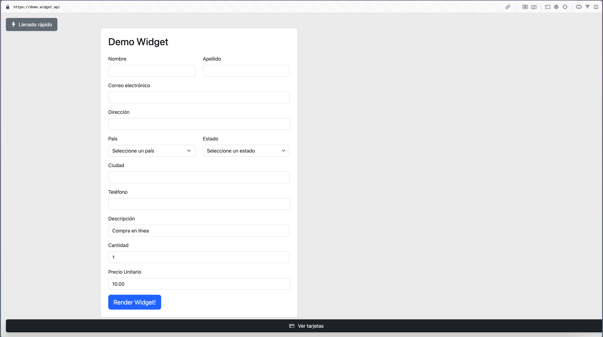

# Widget Demo - Pagos con Widget

Este proyecto es un entorno de prueba para integrar y demostrar el uso de un widget de pagos mediante un iframe. Su propósito principal es facilitar pruebas de integración con servicios de pagos a través de un formulario dinámico.

## 🚀 ¿Qué incluye este demo?

* Formulario de pago con campos dinámicos.
* Render de un iframe con el widget de pagos.
* Evento de retorno del iframe capturado con `postMessage`.
* Transición visual entre estados de carga y éxito.
* Integración a un API para autenticación y ejecución de transacción.

## ⚠️ Aviso Importante

**Este entorno es únicamente para pruebas.**
No debe utilizarse en entornos de producción ni para el procesamiento real de pagos. No se garantiza la seguridad ni el rendimiento fuera del contexto de pruebas.

---

## 📁 Estructura del Proyecto

```
├── app/
│   ├── components/
│   ├── config/
│   ├── css/
│   ├── data/
│   └── pages/
├── nginx/
│   └── certs/            # Certificados autofirmados (estructura vacía)
├── public/
├── docker-compose.dev.yml
├── docker-compose.prod.yml
├── Dockerfile, Dockerfile.dev
├── run-demo.sh
├── run-dev.sh
├── .env, .env.example
└── README.md
```

---

## 🔐 Variables de Entorno

Asegúrate de copiar `.env.example` a `.env` y ajustar tus valores:

```env
# Archivo .env

WIDGET_SUBNET=175.90.0.0/16
NGINX_IP=175.90.0.3
WEB_IP=175.90.0.4
NGINX_PORT=8443

NEXT_PUBLIC_API_BASE_URL=https://sandbox-api.terracall.net
NEXT_PUBLIC_WIDGET_RENDER_URL=https://sandbox-payer.pagadito.com
NEXT_PUBLIC_CLIENT_ID=
NEXT_PUBLIC_CLIENT_SECRET=
NEXT_PUBLIC_CURRENCY_ID=USD
```

El archivo `app/config/widget-config.js` ahora toma valores desde variables de entorno gracias a `process.env`:

```js
const config = {
  base_url: process.env.NEXT_PUBLIC_API_BASE_URL,
  render_url: process.env.NEXT_PUBLIC_WIDGET_RENDER_URL,
  client_id: process.env.NEXT_PUBLIC_CLIENT_ID,
  client_secret: process.env.NEXT_PUBLIC_CLIENT_SECRET,
  currency_id: process.env.NEXT_PUBLIC_CURRENCY_ID || 'USD'
};

export default config;
```

Asegúrate de usar el prefijo `NEXT_PUBLIC_` para que las variables estén disponibles en el frontend.

---

## 🔒 Generar Certificados Autofirmados (Solo para pruebas locales)

1. Abre tu terminal en la carpeta `nginx/certs`
2. Ejecuta:

```bash
openssl req \
  -x509 -nodes -days 365 \
  -newkey rsa:2048 \
  -keyout demo.widget.api.key \
  -out demo.widget.api.crt \
  -subj "/C=US/ST=Local/L=Dev/O=Dev/CN=demo.widget.api"
```

Esto generará `demo.widget.api.crt` y `demo.widget.api.key`.
Asegúrate de montarlos correctamente en tu `nginx` y referenciarlos desde la configuración SSL.

> ⚠️ Estos certificados son solo para uso en ambientes locales. Navegadores como Chrome y Firefox pueden mostrar advertencias.

---

## ▶️ Ejecución en Modo Desarrollo

```bash
./run-dev.sh
```

Esto construirá la imagen y levantará los servicios con `docker-compose.dev.yml`, permitiendo observar los cambios en tiempo real.

## ▶️ Ejecución en Modo Demo (build estatico)

```bash
./run-demo.sh
```

Esto ejecuta el entorno desde un build ya generado. Ideal para revisión sin entorno de desarrollo activo.

---

Dependiendo de tu entorno deberás configurar tu archivo /etc/hosts

Para entornos Linux o MacOS:

```
175.90.0.3 demo.widget.api
```

Para entornos windows, dependiendo de tu configuración de docker podría verse así:

```
127.0.0.1 demo.widget.api
```

---

Si todo está correctamente configurado, puedes visitar [https://demo.widget.api](https://demo.widget.api) y verás algo como esto:



---

## 🛠 Recomendaciones

* No subas tus certificados al repositorio.
* No compartas client secrets ni tokens públicos en `.env`.
* Este entorno no implementa mecanismos avanzados de seguridad.

---

## 📝 Licencia

Este demo se entrega tal cual y no tiene garantía ni soporte oficial.
Distribúyelo únicamente con fines de **testing y desarrollo**.
